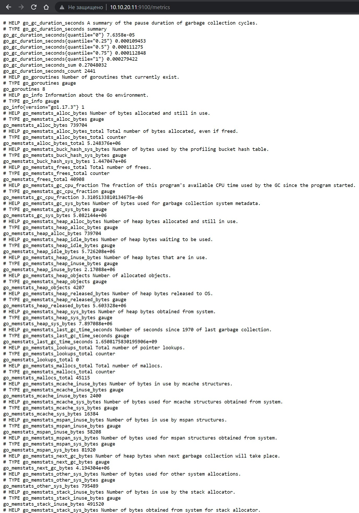
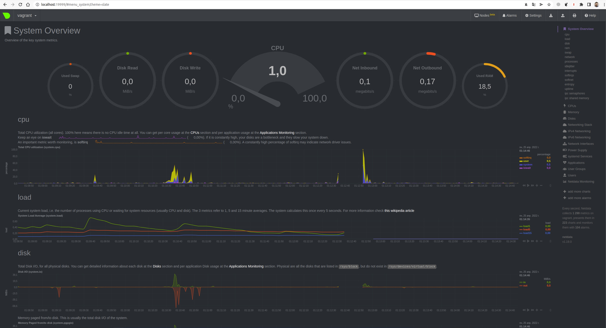

# Домашнее задание к занятию "3.4. Операционные системы, лекция 2"

# Задаяа 1

 На лекции мы познакомились с  [node_exporter](https://github.com/prometheus/node_exporter/releases). В демонстрации его исполняемый файл запускался в background. Этого достаточно для демо, но не для настоящей production-системы, где процессы должны находиться под внешним управлением. Используя знания из лекции по systemd, создайте самостоятельно простой [unit-файл](https://www.freedesktop.org/software/systemd/man/systemd.service.html) для node_exporter:

    * поместите его в автозагрузку,
    * предусмотрите возможность добавления опций к запускаемому процессу через внешний файл (посмотрите, например, на `systemctl cat cron`),
    * удостоверьтесь, что с помощью systemctl процесс корректно стартует, завершается, а после перезагрузки автоматически поднимается.
Ответ 
    


```bash
#Распаковываем
tar zxvf node_exporter-*.linux-amd64.tar.gz
#Переходим в каталог
cd node_exporter-*.linux-amd64
#Копируем
cp node_exporter /usr/local/bin/
#Создаем пользователя node_exporter
useradd --no-create-home --shell /bin/false node_exporter
#Задаем владельца
chown -R :user /usr/local/bin/node_exporter
#Создаем файл node_exporter.service в systemd
touch /etc/systemd/system/node_exporter.service
#Записываем параметры
tee /etc/systemd/system/node_exporter.service<<EOF
[Unit]
Description=Node Exporter Service

[Service]
User=node_exporter
Group=node_exporter
Type=simple
EnvironmentFile=-/etc/default/node_exporter
ExecStart=/usr/local/bin/node_exporter $OPTIONS
Restart=always

[Install]
WantedBy=multi-user.target
EOF
#Перечитываем конфигурацию systemd
systemctl daemon-reload
#Разрешаем автозапуск
systemctl enable node_exporter
#Запускаем службу
systemctl start node_exporter
#Проверяем статус
systemctl status node_exporter
#Можно ещё curl посмотреть
curl http://localhost:9100/metrics
```

# Задание 2.

Ознакомьтесь с опциями node_exporter и выводом `/metrics` по-умолчанию. Приведите несколько опций, которые вы бы выбрали для базового мониторинга хоста по CPU, памяти, диску и сети.


CPU 

node_cpu_seconds_total{cpu="0",mode="idle"} 342931.75

node_cpu_seconds_total{cpu="0",mode="iowait"} 1798.4

node_cpu_seconds_total{cpu="0",mode="irq"} 0

node_cpu_seconds_total{cpu="0",mode="nice"} 108.42

node_cpu_seconds_total{cpu="0",mode="softirq"} 267.65

node_cpu_seconds_total{cpu="0",mode="steal"} 0

node_cpu_seconds_total{cpu="0",mode="system"} 53390.61

node_cpu_seconds_total{cpu="0",mode="user"} 55763.08

node_cpu_seconds_total{cpu="1",mode="idle"} 343640.13

node_cpu_seconds_total{cpu="1",mode="iowait"} 1731.07

node_cpu_seconds_total{cpu="1",mode="irq"} 0

node_cpu_seconds_total{cpu="1",mode="nice"} 122.39

node_cpu_seconds_total{cpu="1",mode="softirq"} 290.14

node_cpu_seconds_total{cpu="1",mode="steal"} 0

node_cpu_seconds_total{cpu="1",mode="system"} 52703.45

node_cpu_seconds_total{cpu="1",mode="user"} 55907.26

memory

go_memstats_alloc_bytes_total 7.635376e+06

disk

node_disk_io_time_seconds_total{device="sda"} 6101.78

node_disk_read_bytes_total{device="sda"} 1.229263872e+09

node_disk_read_time_seconds_total{device="sda"} 319.51800000000003

node_disk_write_time_seconds_total{device="sda"} 9975.556


network

node_network_up{device="eno1"} 1

node_network_up{device="lo"} 0

node_network_up{device="wlx60e3270abba0"} 0

# Задание 3.

Установите в свою виртуальную машину [Netdata](https://github.com/netdata/netdata). Воспользуйтесь [готовыми пакетами](https://packagecloud.io/netdata/netdata/install) для установки (`sudo apt install -y netdata`). После успешной установки:
    * в конфигурационном файле `/etc/netdata/netdata.conf` в секции [web] замените значение с localhost на `bind to = 0.0.0.0`,
    * добавьте в Vagrantfile проброс порта Netdata на свой локальный компьютер и сделайте `vagrant reload`:

    ```bash
    config.vm.network "forwarded_port", guest: 19999, host: 19999
    ```

    После успешной перезагрузки в браузере *на своем ПК* (не в виртуальной машине) вы должны суметь зайти на `localhost:19999`. Ознакомьтесь с метриками, которые по умолчанию собираются Netdata и с комментариями, которые даны к этим метрикам.

Ответ

    

```bash
~/netology --------------------------------------------- 27s | 01:13:00 
> sudo lsof -i :19999
[sudo] пароль для nick: 
COMMAND     PID USER   FD   TYPE DEVICE SIZE/OFF NODE NAME
VBoxHeadl 14054 nick   21u  IPv4  87956      0t0  TCP *:19999 (LISTEN)

vagrant@vagrant:~$ sudo lsof -i :19999
COMMAND PID    USER   FD   TYPE DEVICE SIZE/OFF NODE NAME
netdata 636 netdata    4u  IPv4  23200      0t0  TCP *:19999 (LISTEN)
netdata 636 netdata   48u  IPv4  29866      0t0  TCP vagrant:19999->_gateway:36378 (ESTABLISHED)
```

# Задание 4.

Можно ли по выводу `dmesg` понять, осознает ли ОС, что загружена не на настоящем оборудовании, а на системе виртуализации? 

Ответ

Да

```bash
vagrant@vagrant:~$ dmesg |grep virtual
[    0.001467] CPU MTRRs all blank - virtualized system.
[    0.034039] Booting paravirtualized kernel on KVM
[    0.191714] Performance Events: PMU not available due to virtualization, using software events only.
[    2.450656] systemd[1]: Detected virtualization oracle.

~/netology -------------------------------------------------------------------- INT | 1m 42s | 01:17:38 
> dmesg |grep virtual  
[    0.035621] Booting paravirtualized kernel on bare hardware
```

# Задание 5. 

Как настроен sysctl `fs.nr_open` на системе по-умолчанию? Узнайте, что означает этот параметр. Какой другой существующий лимит не позволит достичь такого числа (`ulimit --help`)?

Ответ

Это максимальное количество дескрипторов файлов, которое процесс может выделить.

```bash
~/netology ------------------------------------------------------------------- INT | 1m 11s | 01:19:22 
> /sbin/sysctl -n fs.nr_open  
1048576
~/netology ------------------------------------------------------------------- 01:21:58 
> ulimit -Hn
1048576
```

# Задание 6.

Запустите любой долгоживущий процесс (не `ls`, который отработает мгновенно, а, например, `sleep 1h`) в отдельном неймспейсе процессов; покажите, что ваш процесс работает под PID 1 через `nsenter`. Для простоты работайте в данном задании под root (`sudo -i`). Под обычным пользователем требуются дополнительные опции (`--map-root-user`) и т.д.

Ответ

```bash
vagrant@vagrant:~$ sudo -i
root@vagrant:~# ps -e |grep sleep
   1658 pts/0    00:00:00 sleep
root@vagrant:~# nsenter --target 1658  --pid --mount
root@vagrant:/# ps
    PID TTY          TIME CMD
   1663 pts/0    00:00:00 sudo
   1665 pts/0    00:00:00 bash
   1678 pts/0    00:00:00 nsenter
   1679 pts/0    00:00:00 bash
   1690 pts/0    00:00:00 ps
```

# Задание 7.

Найдите информацию о том, что такое `:(){ :|:& };:`. Запустите эту команду в своей виртуальной машине Vagrant с Ubuntu 20.04 (**это важно, поведение в других ОС не проверялось**). Некоторое время все будет "плохо", после чего (минуты) – ОС должна стабилизироваться. Вызов `dmesg` расскажет, какой механизм помог автоматической стабилизации. Как настроен этот механизм по-умолчанию, и как изменить число процессов, которое можно создать в сессии?

Ответ

Функция запускает сама себя.

Для ограничивания числа процессов `ulimit -u n` , где n кол-во процессов.


```bash
[  936.731372] cgroup: fork rejected by pids controller in /user.slice/user-1000.slice/session-8.scope
[  984.276808] cgroup: fork rejected by pids controller in /user.slice/user-1000.slice/session-10.scope
```
